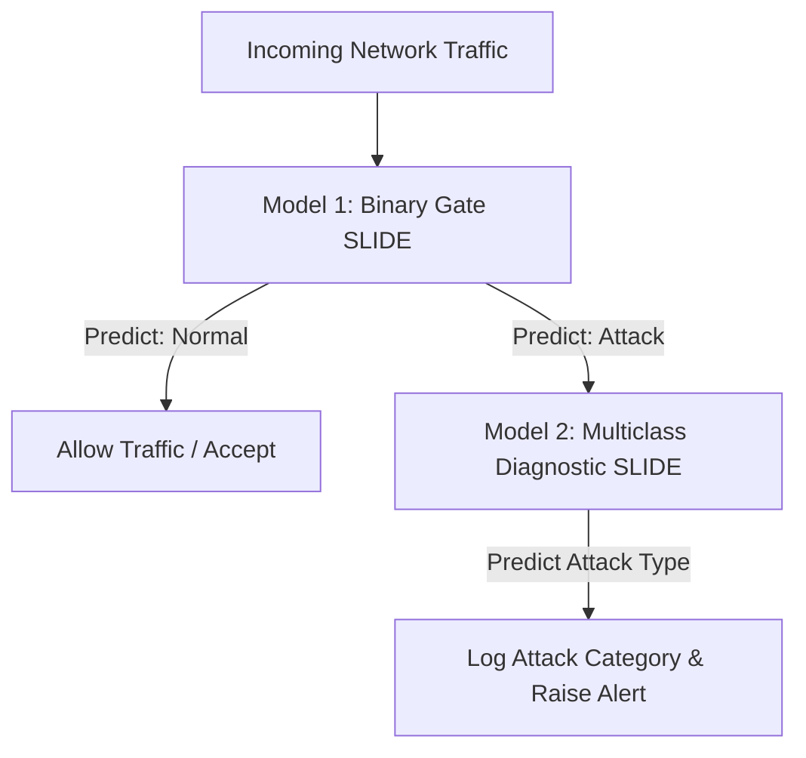

# Implementation Plan: NIDS Evaluation and Optimization (SLIDE)

This document outlines the detailed implementation plans, step-by-step workflows, and project benefits for the three proposed strategies to optimize our Locality Sensitive Hashing (LSH) based NIDS classifier (SLIDE).

---

## Strategy 1: Post-Processor Macro-F1 Evaluation Script

### High-Level Implementation Steps:
1. **Configure SLIDE Predictions Output:**
   * Modify or verify that the SLIDE test execution step outputs a text file (e.g., `predictions.txt`) containing the predicted class index for each test sample sequentially, one per line.
2. **Develop the Python Evaluation Script:**
   * Create `scripts/evaluate_slide.py` using `scikit-learn` to read the true labels (leftmost column in the test SVMLight file) and compare them with the predictions file.
   * Generate class-wise Precision, Recall, F1-Score, and overall Macro-F1.
3. **Automate the Pipeline:**
   * Integrate the evaluation script into a unified test runner (e.g., `run_test.sh`), so that as soon as the SLIDE testing command finishes, the report is compiled and printed immediately.

### Project Benefits & Impact:
*   **Acuracy Inflation Prevention:** Reveals if the model is simply guessing the majority class (`Normal`) to artificially boost global accuracy.
*   **Visibility of Minority Classes:** Ensures that crucial but rare attacks (like `Worms` or `Shellcode`) are tracked individually.
*   **Zero Integration Overhead:** Since calculations are done post-process, there is absolutely zero modification required for the core C++ code of SLIDE, maintaining execution performance.

---

## Strategy 2: Class Weights (Handling Class Imbalance)

### High-Level Implementation Steps:
#### Option A: C++ Source Code Modification (Loss Gradient Scaling)
1. **Calculate Class Weights:**
   * Compute weights on the training dataset using the standard formula: $w_c = \frac{N}{C \times N_c}$ (where $N$ is total samples, $C$ is the 10 classes, and $N_c$ is the samples in class $c$).
2. **Configure SLIDE to Load Weights:**
   * Read these computed weights from a configuration file (e.g., `class_weights.txt` or JSON) during SLIDE initialization.
3. **Modify the Output Layer Delta in C++:**
   * Locate the output layer backpropagation routine in SLIDE's C++ source code.
   * Multiply the error gradient delta ($\delta_L = \mathbf{a}_L - \mathbf{y}$) by the true class weight:
     $$\delta_L = w_{\text{true\_class}} \times (\mathbf{a}_L - \mathbf{y})$$
   * This scales the weight updates so that minority class errors trigger a much larger correction.

#### Option B: Data-Level Resampling (No Code Change)
1. **Oversampling Minority Classes:**
   * Modify the sparsification scripts to duplicate minority class samples (like `Worms` and `Shellcode`) in the generated SVMLight files.
2. **Undersampling Majority Classes:**
   * Limit the maximum number of samples allowed from dominant classes (like `Normal` and `Generic`) to balance the distribution.

### Project Benefits & Impact:
*   **Forced Model Attention:** Prevents the optimizer from taking the "easy route" of ignoring rare attacks.
*   **Dramatically Higher Recall for Critical Attacks:** Ensures that rare, high-risk security threats are learned and recognized by the model.
*   **Tunable Penalties:** Allows researchers to adjust weights based on security severity (e.g., magnifying the penalty for malware families that are extremely destructive).

---

## Strategy 3: Hierarchical Classifier Gate (Cost-Sensitive "Benign vs. Attack" Priority)

### High-Level Implementation Steps:
1. **Prepare Binary & Attack-Only Datasets:**
   * Generate a binary version of the sparsified dataset (0 = Normal, 1 = Any Attack).
   * Generate an attack-only version of the dataset containing only the 9 attack categories (completely excluding `Normal` samples).
2. **Train the Binary Gate Model (Model 1):**
   * Train a SLIDE model to act as a fast gatekeeper. Its only job is to classify traffic as *Benign* or *Attack*.
3. **Train the Diagnostic Model (Model 2):**
   * Train a second SLIDE model specifically to classify attack signatures (Exploit, DoS, Worm, etc.). It only sees malicious data.
4. **Implement the Routing Pipeline:**
   * Write an orchestration script that routes incoming traffic. If Model 1 flags a connection as `Attack`, the features are passed to Model 2 for detailed classification. If Model 1 says `Normal`, the connection is allowed.

### Project Benefits & Impact:
*   **Security Priority Alignment:** Directly minimizes False Negatives (attacks slipping through undetected), which is the most critical failure mode in NIDS.
*   **Reduced Mathematical Complexity:** Avoids modifying C++ backpropagation loss algorithms to achieve cost-sensitive learning.
*   **Simpler Decision Boundaries:** Model 1 only needs to learn a simple two-class boundary, while Model 2 is relieved of learning the vast `Normal` traffic distribution, leading to higher overall accuracy for both tasks.
